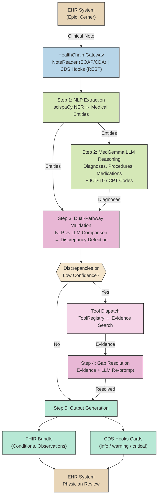

# MedScribe Agent — Architecture

## Pipeline Overview

MedScribe implements a 5-step agentic pipeline for autonomous clinical documentation coding. The dual-pathway design (NLP + LLM) with validation and gap resolution ensures coding accuracy beyond either pathway alone.

## Component Mapping

| Pipeline Step | Module | Key Class / Function |
|---|---|---|
| Gateway | `medscribe.src.gateway.app` | `create_app()` → HealthChainAPI |
| Step 1: NLP | `medscribe.src.pipeline.coding_pipeline` | `build_coding_pipeline_simple()` → scispaCy NER |
| Step 2: LLM | `medscribe.src.models.medgemma` | `MedGemmaClient` / `DemoMedGemmaClient` |
| Step 3: Validation | `medscribe.src.agent.validator` | `DualPathwayValidator.compare()` |
| Step 4: Tool Dispatch | `medscribe.src.agent.tools` | `ToolRegistry.execute()` → evidence search (FHIR or mock) |
| Step 4: Gap Resolution | `medscribe.src.agent.orchestrator` | `_resolve_with_tools()` → evidence + `reason_with_resolution()` |
| Step 5: Output | `medscribe.src.agent.orchestrator` | `MedScribeAgent._build_fhir_bundle()` / `_build_cds_cards()` |
| Orchestrator | `medscribe.src.agent.orchestrator` | `MedScribeAgent.run()` |

## Data Flow

1. **EHR → Gateway**: Clinical note arrives via SOAP/CDA (NoteReader) or REST (CDS Hooks)
2. **Gateway → NLP**: Raw text extracted, passed to scispaCy for entity recognition
3. **NLP + LLM → Validation**: Both pathways produce findings; validator detects discrepancies
4. **Validation → Tool Dispatch → Resolution**: Agent dispatches ToolRegistry tools (condition/medication/lab search) based on discrepancy type, gathers evidence, then re-prompts LLM
5. **Resolution → Output**: Final diagnoses converted to FHIR Bundle + CDS Hooks Cards for physician review
